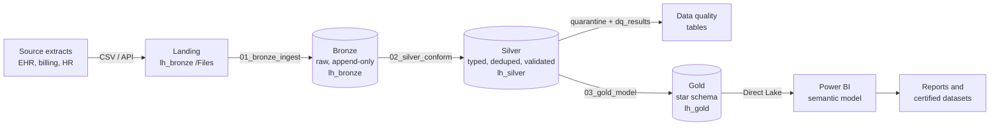

# fabric-lakehouse-blueprint

A reference architecture for a governed **Microsoft Fabric Lakehouse** for healthcare operations data, with working PySpark notebooks, naming conventions, and a decision log that records *why* each choice was made. It is written from the perspective of the person who has to maintain the platform six months later, not just the person building the demo.

Everything runs on synthetic data from [synthetic-snf-data-generator](https://github.com/shaunazamarripa-svg/synthetic-snf-data-generator). No PHI, and nothing here comes from any employer's systems.

## Architecture

| Layer | Contains | Rule of thumb |
|---|---|---|
| Landing | Files exactly as delivered | Never edited, never queried by reports |
| Bronze | Delta tables, all columns as strings, lineage columns (`_batch_id`, `_ingest_ts`, `_source_file`) | Append-only. If it arrived, it is here. |
| Silver | Typed, deduplicated (latest row per business key), validated | Bad rows go to `<table>_quarantine`, counts go to `dq_results`. The load never silently drops data. |
| Gold | Conformed dimensions, additive facts, an AR aging snapshot | Business logic is defined once here, not repeated in every report. |

## What is in the repo

| Path | Purpose |
|---|---|
| [`notebooks/01_bronze_ingest.py`](notebooks/01_bronze_ingest.py) | Land CSVs into Delta with lineage columns, append-only |
| [`notebooks/02_silver_conform.py`](notebooks/02_silver_conform.py) | Data contract (keys, types, rules), dedupe, quarantine, DQ results |
| [`notebooks/03_gold_model.py`](notebooks/03_gold_model.py) | Star schema, length of stay, AR aging buckets, census reconciliation check |
| [`docs/naming-conventions.md`](docs/naming-conventions.md) | Workspaces, lakehouses, tables, columns, notebooks |
| [`docs/decision-log.md`](docs/decision-log.md) | Architecture decisions with context, options, and tradeoffs |

## How to run it

1. Generate the data: `python generate_snf_data.py --seed 42` from the generator repo.
2. In a Fabric workspace named `ws_snf_dev`, create three lakehouses: `lh_bronze`, `lh_silver`, `lh_gold`.
3. Upload the generated CSVs to `lh_bronze` under `Files/landing/snf/`.
4. Import each notebook and attach the matching lakehouse as its default (bronze to `lh_bronze`, silver to `lh_silver`, gold to `lh_gold`).
5. Run them in order, or chain them in a Data Pipeline that passes the pipeline run ID as `BATCH_ID`.
6. Check `dq_results` in `lh_silver`, and confirm notebook 03 finishes with `Census reconciliation mismatches: 0`.

**Requirements:** a Fabric-enabled capacity (a Fabric trial works for experimenting; production needs a paid F SKU or Premium capacity). Direct Lake semantic models also require Fabric capacity.

## Status and honesty note

The notebooks are reference implementations written for Fabric Spark runtimes. They have been syntax-checked, but treat them as a starting point and validate in your own tenant before reuse. The synthetic dataset behind them is verified separately (its census reconciles exactly to its stays), and the gold notebook re-tests that property on every run.

## Design principles

- **Governance first.** Environments, naming, and data-quality gates are part of the design, not an afterthought.
- **Reproducible.** Parameterized notebooks, deterministic data, no hard-coded IDs.
- **Explainable.** Every layer has one job, and every decision is written down.
- **PHI-aware.** In production, this pattern pairs with sensitivity labels, workspace-level access by layer, row-level security in the semantic model, and no data values in notebook logs. See the decision log.

## Roadmap

- Data Pipeline JSON for orchestration and failure alerts
- Incremental (merge-based) silver loads for large fact tables
- A semantic model and report on top of gold, documented in [powerbi-governance-framework](https://github.com/shaunazamarripa-svg/powerbi-governance-framework)

## License

MIT. See [LICENSE](LICENSE).
